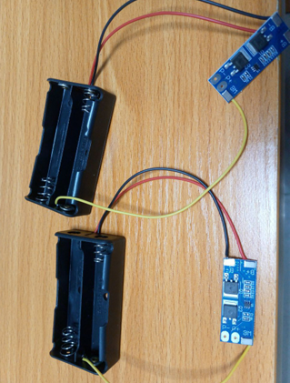
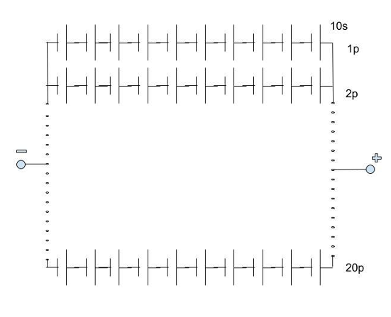
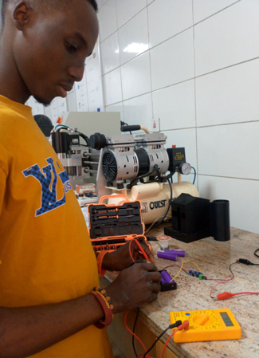

# Battery Pack Design — 10s20p Li-ion

> Study and hands-on implementation of Li-ion battery pack design covering 
> cell combinations, Battery Management Systems (BMS), load calculations 
> and live testing. Completed during SIWES industrial training at NITDA 
> IT Hub, University of Lagos.

## Overview
During my 6-month industrial training at NITDA IT Hub (NitHub), I learned 
the complete process of designing a battery pack — from understanding cell 
chemistry and series/parallel configurations, to selecting an appropriate 
BMS and verifying the pack under real charge conditions using a multimeter.

## Key Concepts Covered
- Li-ion cell series and parallel combinations
- Voltage and capacity calculations for battery packs
- Battery Management System (BMS) — purpose, selection and wiring
- Load requirement analysis
- Safe charging and discharging practices
- Hands-on measurement of battery voltage during charge cycle

## 10s20p Configuration
| Parameter | Value |
|---|---|
| Series cells | 10s |
| Parallel cells | 20p |
| Nominal cell voltage | 3.7V |
| Pack nominal voltage | 37V |
| Total cells | 200 |

## Tools Used
- Multimeter (voltage measurement during charging)
- BMS board for cell protection and balancing
- Battery holder/case for physical cell arrangement

## Diagrams & Photos

### 10s20p Cell Combination Schematic

### Battery Case with BMS

### Measuring Battery During Charging

## What I Learned
- How to calculate voltage, capacity and energy for custom battery packs
- Series vs parallel cell configuration tradeoffs
- Role and wiring of a Battery Management System (BMS)
- Safe lab practices for Li-ion battery handling and testing
- Relevance of power electronics (AC-DC converters, buck converters)
  in battery charging systems
